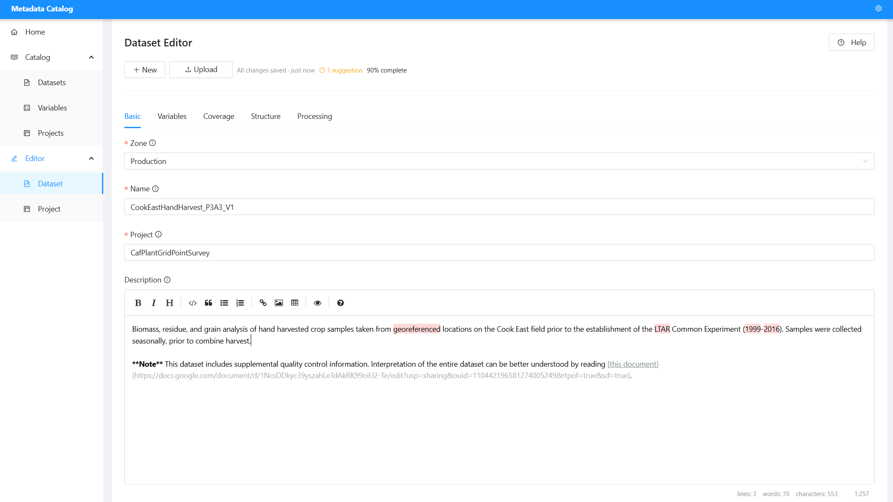
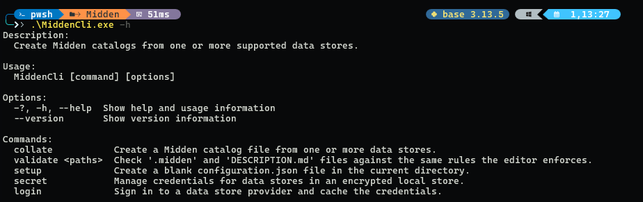
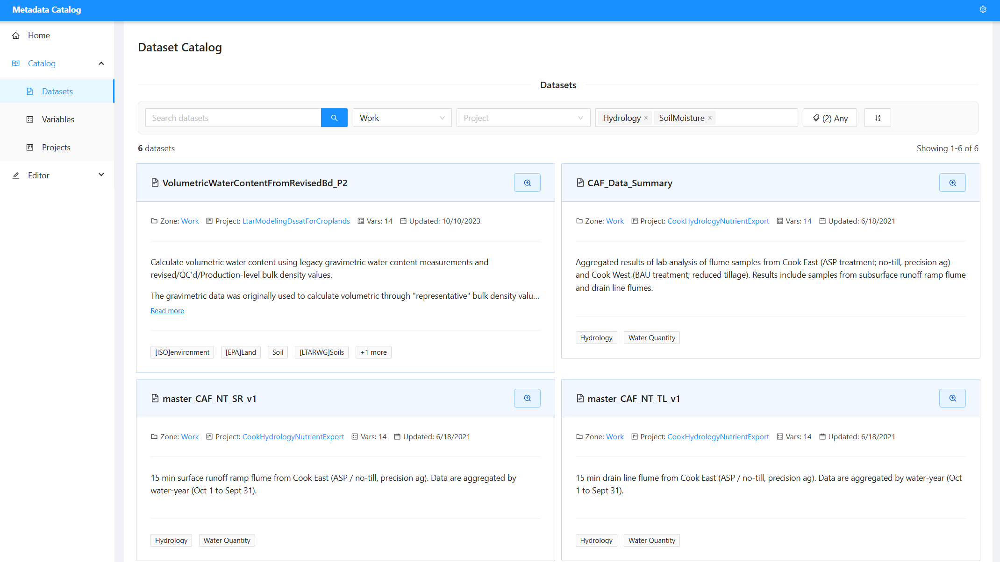
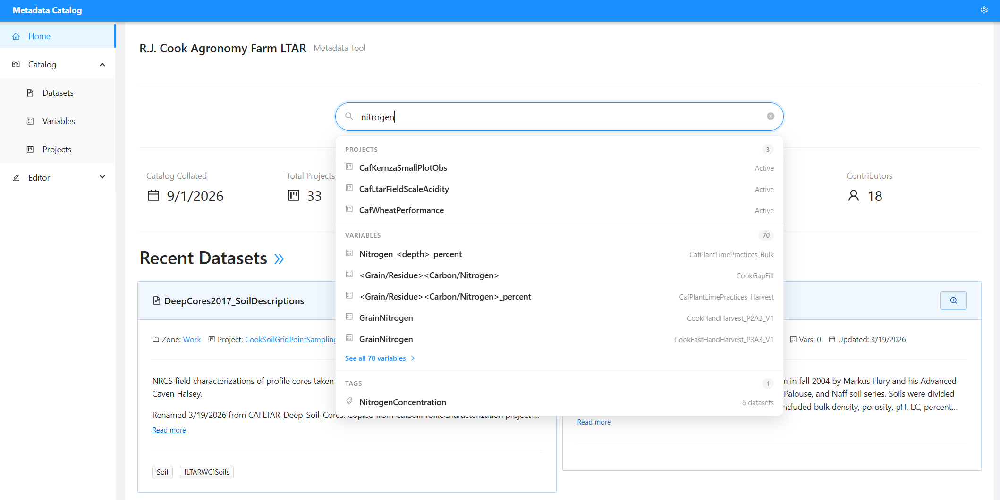
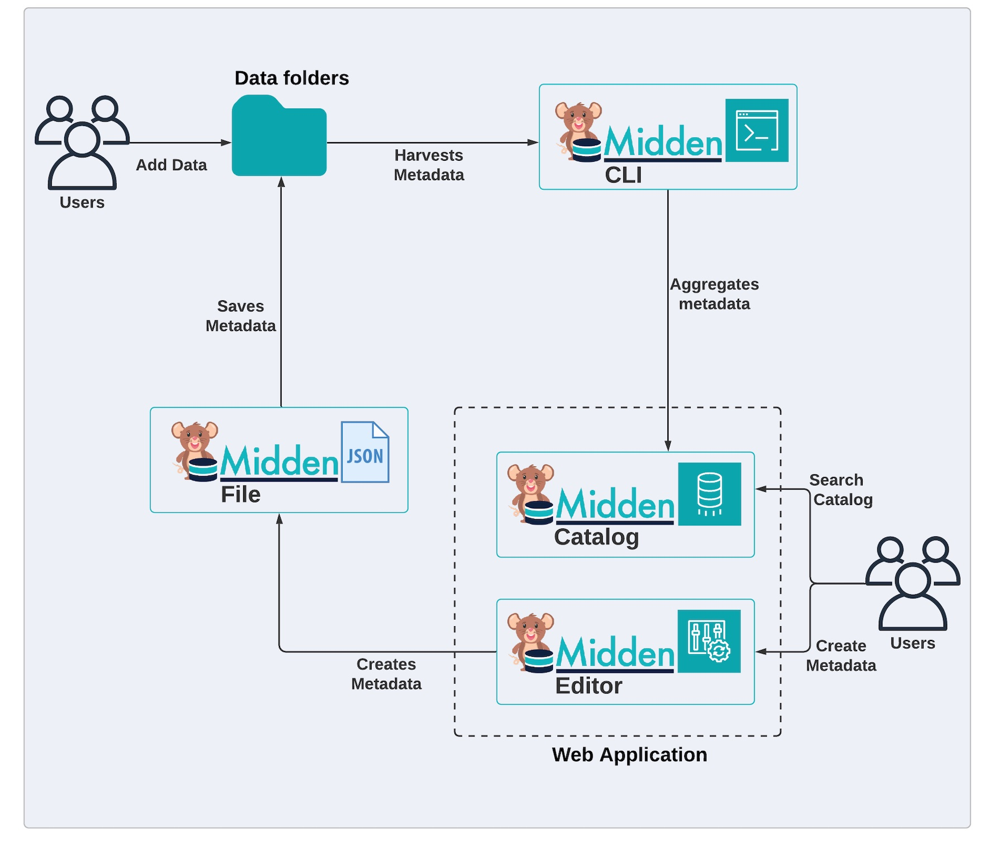
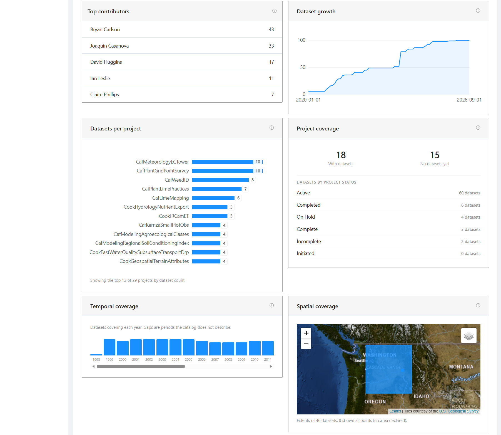
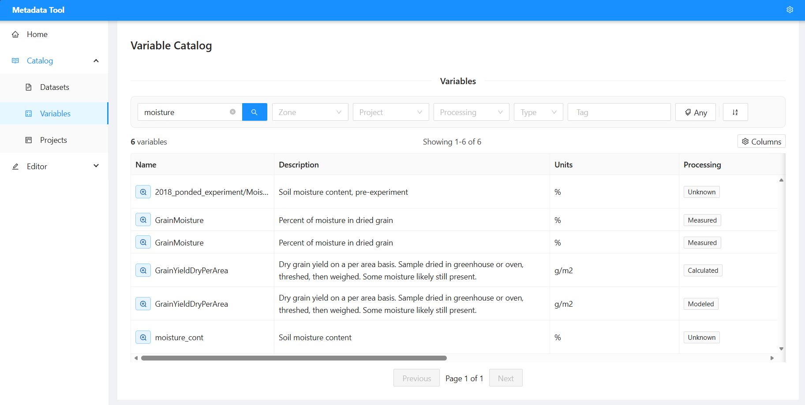
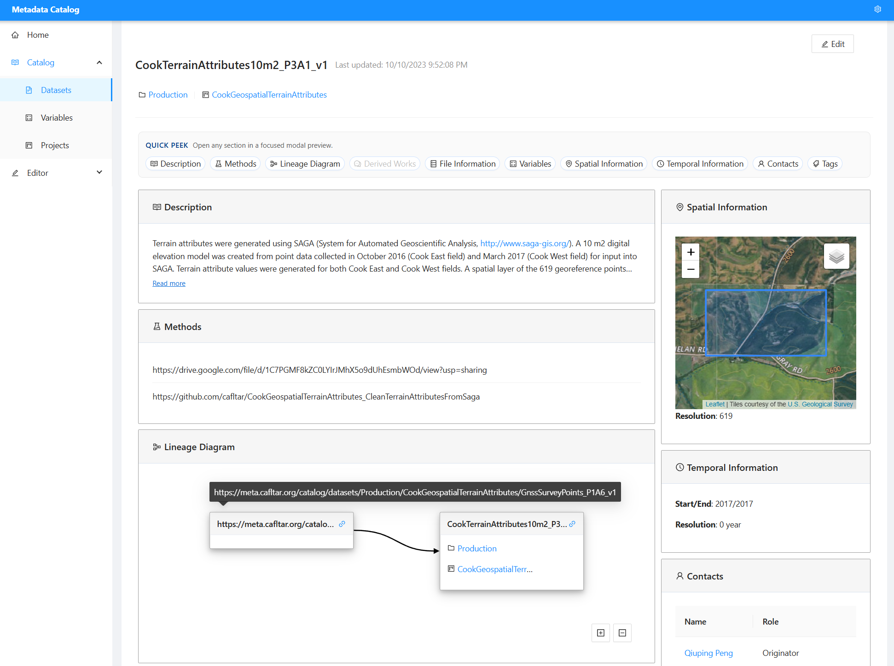

# Midden

**See it in action:** Browse the [CAF LTAR Midden catalog](https://meta.cafltar.org).

Midden is a data catalog that is easily adaptable to fit within a typical researcher's workflow. Midden solves the problem of "who is collecting what data, and where can I access it?" that is the bane of many large academic research projects.

## Motivation

There are numerous solutions for cataloging data to make it discoverable. Many of these
solutions, however, require technical knowledge that is uncommon among academic researchers.
Many researchers feel at ease managing their data through their native filesystem, an approach
reflected in [Good enough practices in scientific computing](https://journals.plos.org/ploscompbiol/article?id=10.1371/journal.pcbi.1005510),
[Cornell's file-management guidance](https://data.research.cornell.edu/content/file-management),
and the [University of Arizona's data-organization guidance](https://lib.arizona.edu/research/data/data-management/best-practices/data-organization).
Despite that, many data catalogs require complex systems more typical of teams with dedicated
data scientists and data engineers.

Midden meets researchers where they are comfortable.

## Overview

Midden is a suite of three tools: an editor, a crawler, and a data catalog. The editor and catalog
are one static web application that can be hosted on services such as
[GitHub Pages](https://pages.github.com/),
[Azure Static Web Apps](https://azure.microsoft.com/products/app-service/static), or
[Netlify](https://www.netlify.com/). The crawler is a cross-platform command-line application.

Pick the path that sounds most like what you came here to do:

| I want to... | Start here |
|---|---|
| Browse a catalog or create metadata | [Use Midden](#use-midden) |
| Find metadata and build `catalog.json` | [Run the CLI](#run-the-cli) |
| Host an editor and catalog for my organization | [Deploy your own](#deploy-your-own) |
| Build, test, or contribute to Midden | [Develop Midden](#develop-midden) |

## Releases and support

Official versions and self-contained CLI downloads are published through
[GitHub Releases](https://github.com/CafIncubator/Midden/releases). See the
[changelog](CHANGELOG.md) for release history and upgrade notes, and the
[versioning policy](VERSIONING.md) for the shared CLI, Core, and Wasm version rules.

Only the latest GitHub Release receives fixes; older releases and development builds are not
supported. See [SECURITY.md](SECURITY.md) for the complete support and private vulnerability
reporting policy.

### The Editor

Midden has a metadata editor that supports fields common in many standard metadata formats including contact info, data dictionaries, methods, tags, spatial information, and much more.



### The Crawler

Midden has a cross-platform command-line interface with commands to crawl various data stores (local file system, Google Workspace Shared drive, Azure Data Lake Gen 2, more coming soon...) and collates all metadata into a single file.



### The Catalog

Midden supports viewing all metadata through a rich interactive interface that supports global search through datasets, variables, projects, and tags.





## The workflow

1. Researcher sciences, creates a dataset
2. Researcher uses the Editor to create metadata then downloads and saves the file alongside the dataset
3. Researcher (or an automated script) runs the Crawler
4. The data catalog is updated with the new metadata
5. Collaborators find the data through the catalog, rejoice



## Screenshots

**Catalog Insights** helps your team and collaborators understand your data holdings at a glance.



---

**Variable Data Catalog** allows searching for specific variables across all datasets.



---

**Dataset Details** shows all metadata of a given dataset.



---

## Use Midden

Open your organization's Midden site to browse its catalog or create metadata in the editor. The
editor downloads a `.midden` metadata file; save that file beside the dataset it describes so the
crawler can find both. A screenshot may be worth a thousand words, but only the metadata file can
tell the crawler who collected the soil-moisture readings in 2019.

The [CAF LTAR Midden catalog](https://meta.cafltar.org) is a live example. Its vocabulary and data
belong to that organization; your own deployment can use terminology that fits your research.

## Run the CLI

The Midden CLI validates metadata, crawls local and cloud data stores, and collates the results
into `catalog.json`. Follow the [CLI usage guide](docs/usage-guides/cli-usage.md) for installation,
configuration, secrets, provider sign-in, automation, and troubleshooting.

If something has gone sideways, start with the
[troubleshooting guide](docs/usage-guides/troubleshooting.md). It knows about missing
configuration, secret-store errors, partial crawls, deployment routes, stale catalogs, and the
occasional successful HTTP response containing entirely the wrong thing.

## Deploy your own

Midden can be published to any static host that serves Blazor WebAssembly files and supports a
single-page application fallback. The maintained [deployment guide](docs/usage-guides/deployment.md)
covers publishing, `app-config.json`, catalog updates, base paths, GitHub Pages, Netlify, Azure
Static Web Apps, cache behavior, verification, and rollback.

Use the [configuration reference](docs/usage-guides/configuration.md) and its safe examples to
adapt the vocabulary without accidentally publishing credentials. The catalog is public by
design; surprises should be limited to interesting datasets.

## Why "Midden"?

A midden is a refuse heap created by various entities such as packrats, earthworms, and human societies. It is also a rich source of information for scientists trying to study a system. The Midden Data Catalog takes datasets without any context (i.e. "refuse") and helps apply metadata so it becomes information; a digital midden, if you will.

## Develop Midden

Start with the [architecture overview](docs/architecture/overview.md) for the Core, CLI, and Wasm
boundaries, data flow, crawler abstractions, validation, and credential model. See
[the documentation index](docs/README.md) for the complete document set and
[CONTRIBUTING.md](CONTRIBUTING.md) for the contributor workflow.

### Developer baseline

The repository requires the .NET SDK selected by `global.json`. From the repository root, restore,
build, and run the deterministic test suite with:

```powershell
dotnet restore Caf.Midden.slnx
dotnet build Caf.Midden.slnx --configuration Release --no-restore
dotnet test Caf.Midden.slnx --configuration Release --no-build
```

Live cloud integration tests are explicit and require private provider credentials. After following
the setup in [the live-test guide](Caf.Midden.Cli.LiveTests/README.md), opt in from the repository root:

```powershell
dotnet test Caf.Midden.Cli.LiveTests --configuration Release -- xUnit.Explicit=only
```

## Contributing

Contributions from researchers, data managers, developers, technical writers, and other users
are welcome. See [CONTRIBUTING.md](CONTRIBUTING.md) for setup, testing, and pull request guidance.

Use the channels in [SUPPORT.md](SUPPORT.md) for questions and issue reports. Before
participating, read [CODE_OF_CONDUCT.md](CODE_OF_CONDUCT.md). Project roles and decision-making
are described in [GOVERNANCE.md](GOVERNANCE.md). Report suspected vulnerabilities privately by
following [SECURITY.md](SECURITY.md).

## Attribution

Original work was supported by the R.J. Cook Agronomy Farm, a member of the USDA Long-Term Agroecological Research network.

The Midden web tools rely heavily on the UI component library [Ant Design Blazor](https://github.com/ant-design-blazor/ant-design-blazor).

## License

Portions prepared by United States Government employees as part of their official duties are
not subject to copyright protection in the United States under 17 U.S.C. 105. To the extent
copyright or patent rights apply and are licensable, Midden is distributed under the
[Apache License, Version 2.0](LICENSE.md). See [NOTICE.md](NOTICE.md) for the complete federal
public-domain and prior-release notice.
