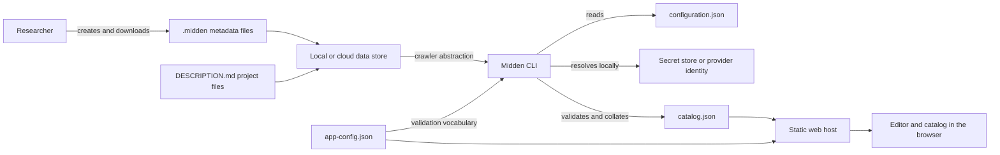

# Midden architecture

Midden is three cooperating tools with one shared understanding of metadata. The pieces are
separate on purpose: researchers can edit metadata without installing the crawler, and a
published catalog never needs the credentials used to find that metadata.

## Components

| Component | Responsibility |
|---|---|
| `Caf.Midden.Core` | Metadata and project models, file conventions, parsing, validation, configuration reading, and catalog analysis shared by the other applications |
| `Caf.Midden.Cli` | Configuration, credentials, crawling local and cloud data stores, validation, and collation into `catalog.json` |
| `Caf.Midden.Wasm` | Static Blazor WebAssembly editor and catalog that run in the browser |

The test projects follow the same boundary. Core tests exercise metadata behavior, CLI tests use
fake file systems and provider gateways, and live tests cover explicitly selected cloud
integrations. Live credentials are never required by the ordinary test suite.

## Data flow

The editor creates a metadata file for the researcher to save alongside a dataset. The CLI then
visits each configured data store, finds metadata and optional project descriptions, parses and
validates them through Core, and writes one catalog. The Wasm application reads that catalog to
provide dataset, project, variable, tag, and global search views.

This is a publish workflow rather than a database-backed service. Updating the public catalog
means producing and deploying a new `catalog.json`; no crawler or cloud credential runs in a
visitor's browser.

## Core and validation

Core is the shared contract between editing, crawling, and browsing. Its services cover:

- Midden file naming and discovery conventions;
- metadata and project parsing;
- application configuration reading;
- metadata, temporal extent, geometry, dataset name, and project validation;
- data dictionary reading and writing; and
- catalog reading, analysis, and search inputs.

Keeping these rules in Core prevents the editor and CLI from developing charming but
incompatible opinions about what valid metadata looks like. Tests in `Caf.Midden.Core.Tests`
are the executable reference for supported metadata and application-configuration versions.

## CLI and crawler abstractions

The CLI orchestrates work through abstractions in `Caf.Midden.Cli/Common` and provider-specific
implementations in `Caf.Midden.Cli/Services`. The current crawler implementations support local
files, Azure Data Lake Gen2, Azure Files, Google Drive, and Google Workspace Shared Drives.

Provider gateways isolate remote API calls from crawl and collation behavior. Contract tests can
therefore exercise pagination, path handling, failures, and duplicate datasets without a cloud
account. The separate live-test project remains available for deliberate checks against real
providers.

`configuration.json` selects the stores to crawl. `app-config.json` supplies the controlled
vocabularies used during validation. See the
[CLI usage guide](../usage-guides/cli-usage.md#the-configuration-file) for operating details and
secret handling.

## Wasm application

`Caf.Midden.Wasm` is a static Blazor WebAssembly application. At startup it creates an HTTP
client rooted at the deployed base address and reads `app-config.json` from that location. The
configured `catalogPath` identifies the catalog to load. It may be relative to the deployed
application or an absolute HTTPS URL; a cross-origin catalog host must allow the application
origin through CORS. Both JSON files are static deployment inputs and are copied into published
output by the Wasm project when they live with the application.

The same browser application provides editor and catalog routes. Editor downloads stay on the
researcher's machine until that person puts the metadata file beside the corresponding dataset.
Catalog routes consume the collated output; they do not modify source data stores.

## Versions and compatibility

Metadata files, CLI configuration, and application configuration have separate format versions.
Their version fields describe data formats, not necessarily the installed product release.
Readers and validators in Core and the CLI decide which versions are accepted.

Do not change a format version merely because Midden itself has a new release. A format change
needs corresponding reader, validation, fixture, compatibility, and migration updates. The
[configuration reference](../usage-guides/configuration.md) records the currently supported
application and CLI formats.

## Credential boundary

Credentials belong to the CLI side of the diagram:

- literal secrets should not be placed in `configuration.json`;
- encrypted local secrets, environment variables, managed identities, or provider-specific
  cached sign-ins are resolved while the CLI runs;
- `catalog.json` and `app-config.json` are public deployment inputs and must contain no secrets;
- browser code does not receive data-store credentials; and
- generated credential files and tokens remain untracked.

This boundary is both simpler and safer: the static catalog can be hosted almost anywhere, and
its host does not need permission to read the original data stores.

## Where to make a change

| Change | Start here |
|---|---|
| Metadata model or validation rule | `Caf.Midden.Core/Models` and `Caf.Midden.Core/Services/Validation` |
| Metadata or project parsing | `Caf.Midden.Core/Services/Metadata` or `Caf.Midden.Core/Services` |
| New crawl provider | `Caf.Midden.Cli/Common` and `Caf.Midden.Cli/Services` |
| CLI orchestration or commands | `Caf.Midden.Cli/Actions` |
| Editor or catalog behavior | `Caf.Midden.Wasm/Pages`, `Shared`, and `Services` |
| Deployment-time vocabulary or catalog location | `Caf.Midden.Wasm/wwwroot/app-config.json` |

Update the matching tests and this overview when a change moves one of these boundaries. Tribal
knowledge is useful around a campfire; it is less useful during a release.